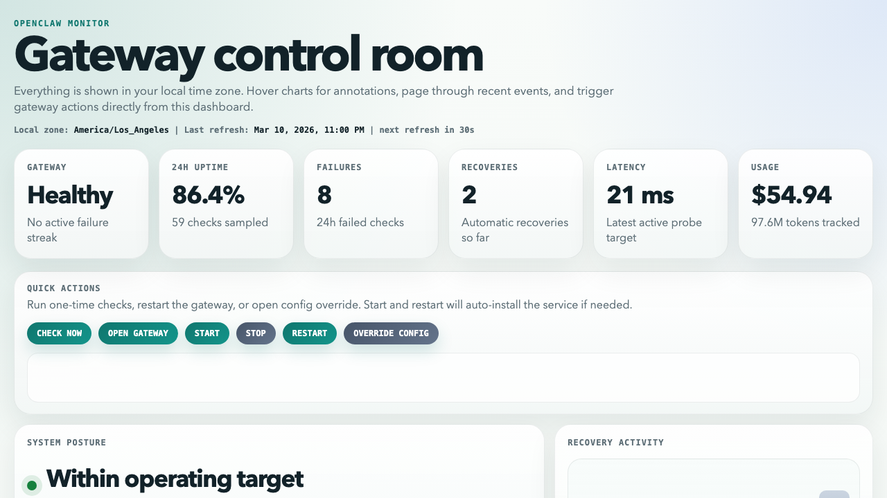

# OpenClaw Monitor

OpenClaw Monitor is a local watchdog and ops dashboard for the OpenClaw gateway.

It is built for the failure mode where the gateway goes down, restart attempts do not fully bring it back, and you only notice later when something important has already stalled. This project keeps a close eye on the gateway, attempts recovery automatically, records what happened, and gives you a local control room to inspect health, recovery history, and usage.



## Why it exists

OpenClaw is useful, but when the gateway gets into a bad state, reliability is what matters most.

This project helps with that by:

- checking gateway health on a schedule
- retrying recovery when the gateway stays down
- logging incidents and recovery work
- surfacing uptime and usage in a local dashboard
- making common actions available directly from the UI

## What you get

- Automatic gateway health checks using `openclaw gateway status --json`
- Configurable recovery flow with `restart`, `start`, and `install` fallback behavior
- macOS `launchd` integration so it can run unattended on a Mac mini
- Local notifications for prolonged downtime or failed recovery
- A dashboard with availability, recovery activity, recent events, and usage cost
- Quick actions for one-time check, start, stop, restart, open gateway, and config override
- Event history and snapshots stored locally in plain files

## Quick start

### 1. Install and build

```bash
npm install
npm run build
```

### 2. Run one manual check

```bash
npm run check
```

This performs a health check immediately and records the result under `data/`.

### 3. Open the dashboard

```bash
npm run dashboard
```

Then open [http://127.0.0.1:4317](http://127.0.0.1:4317).

### 4. Install the background service on macOS

```bash
npm run service:install
npm run service:status
```

That installs a `launchd` agent so checks continue running in the background.

## Dashboard highlights

- Availability trend: 24 hours of 15-minute uptime buckets
- Recovery activity: steps and outcomes grouped by local day
- Recent events: paginated and filterable by level, type, and text
- Quick actions: run operational commands without leaving the page
- Config override: adjust check interval and thresholds from the UI
- Usage cost: daily cost view plus grouped totals by source

## Commands

```bash
npm run build
npm run check
npm run collect
npm start
npm run dashboard
npm run report
npm run service:install
npm run service:status
npm run service:uninstall
```

## Default configuration

Configuration lives in `openclawmonitor.config.json`.

```json
{
  "checkIntervalMinutes": 5,
  "failureThreshold": 3,
  "recoveryCooldownMinutes": 15,
  "statusTimeoutMs": 10000,
  "dataDir": "./data",
  "openclawBin": "/opt/homebrew/bin/openclaw",
  "dashboardPort": 4317,
  "usageImportDir": "./data/usage-imports",
  "usageGatewayCategory": "gateway",
  "notifications": {
    "enabled": true,
    "title": "OpenClaw Monitor",
    "downtimeAlertMinutes": 15,
    "repeatAlertMinutes": 30
  },
  "collectors": {
    "probe": true,
    "health": true,
    "usageCost": true,
    "usageCostDays": 30
  },
  "launchd": {
    "label": "ai.openclaw.monitor",
    "runAtLoad": true
  },
  "recoverySteps": ["restart", "install", "restart"]
}
```

Most important settings:

- `checkIntervalMinutes`: how often the monitor runs
- `failureThreshold`: consecutive failed checks before recovery starts
- `recoveryCooldownMinutes`: minimum delay between recovery attempts
- `statusTimeoutMs`: timeout for OpenClaw health commands
- `openclawBin`: absolute path to the OpenClaw CLI, recommended for `launchd`

## Local data

Runtime data is intentionally simple and inspectable:

- `data/state.json`: current monitor state
- `data/events.jsonl`: event history
- `data/snapshots/`: latest collected `probe`, `health`, and `usage-cost`
- `data/launchd.out.log`: background service output
- `data/launchd.err.log`: background service errors

## Imported usage sources

The dashboard can merge additional usage sources beyond the built-in OpenClaw usage collector.

Drop JSON files into `usageImportDir` with this shape:

```json
{
  "sourceId": "openai-api",
  "label": "OpenAI API",
  "category": "openai_api",
  "collectedAt": "2026-03-10T18:00:00.000Z",
  "payload": {
    "totals": {
      "totalCost": 12.34,
      "totalTokens": 123456
    },
    "daily": []
  }
}
```

That makes it possible to compare OpenClaw usage with other paths such as OpenAI API or OAuth-backed tooling.

## Roadmap

- Better channel status cards for WhatsApp and other integrations
- Incident grouping so repeated failures become one outage view
- Richer usage breakdowns across multiple billing paths
- Optional webhooks, Slack, email, or Telegram alerts
- Retention policies for longer-running deployments

## Who this is for

OpenClaw Monitor is useful if you:

- run OpenClaw on a dedicated Mac mini or home server
- want automatic recovery instead of manual babysitting
- need a local dashboard instead of digging through logs
- want to understand how often the gateway is failing and what recovery did

## Status

This project is already usable as a local reliability tool, and it is structured to grow into a fuller monitoring and usage console over time.
